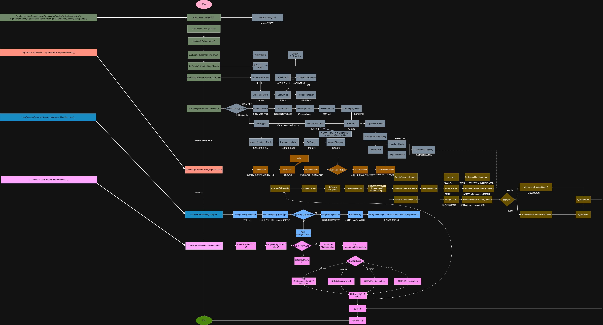

# 手写 MyBatis ORM 框架
## 项目说明
想必大家都有听过MyBatis框架，目前主流的ORM框架，在工作之中我们在很多场景都会用到它。  
在面试中，MyBatis相关的问题也是屡见不鲜。  
然而，像我们新手学习这种框架的源码，其实是很困难的，但我们也要坚持学习下去，相信最后一定会有收获！  
为了能够了解MyBatis框架的实现过程，同时也为了加深对MyBatis框架的理解，  
我总结了我学习的MyBatis的知识，打算从零到一手写一个MyBatis ORM框架(简易版，没有完全实现)，  
从中体会MyBatis的实现的过程。 
## 框架功能

## 框架流程图

## 文档
文档在这里  
https://github.com/javaKing-lgy/douyu-live-app/tree/master/doc
## 目录结构
java  
└── cn  
    └── lgyjava  
        └── mybatis  
            ├── annotations  
            ├── binding  
            ├── builder  
            ├── cache  
            ├── datasource  
            ├── executor  
            ├── io  
            ├── mapping  
            ├── parsing  
            ├── plugin  
            ├── reflection  
            ├── scripting  
            ├── session  
            ├── transaction  
            └── type  

## 最后
关于这部分全部的知识，大家可以到官网查看 https://mybatis.org/mybatis-3/zh_CN/index.html   
我也推荐 小傅哥 我从他的Mybatis手撸专栏中也学到了很多很多  https://bugstack.cn/md/about/me/about-me.html   
想学习java 我也推荐看小傅哥。    
## 你的点赞鼓励，是我前进的动力~

## 你的点赞鼓励，是我前进的动力~

## 你的点赞鼓励，是我前进的动力~

## 

