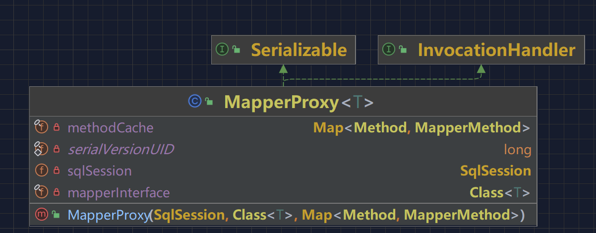
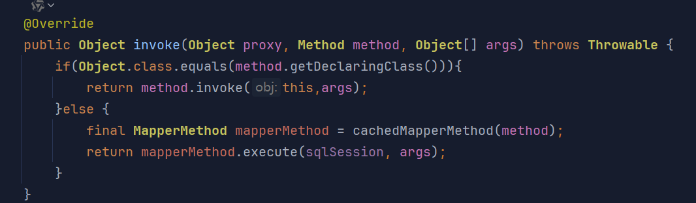
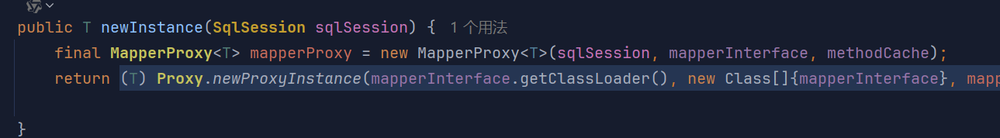
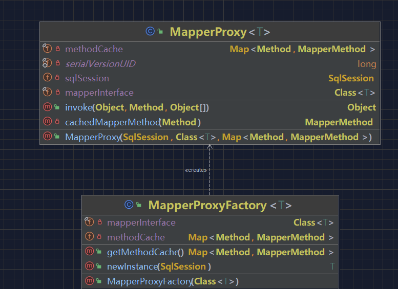

## 引言

尝试手写一个MyBatis ORM框架。从中提升自己的编码能力，以及学习优秀的代码编写。

## 会什么会出现MyBatis这样的ORM框架？

大家都使用过JDBC吧

MyBatis 等 ORM 框架的出现是为了解决 JDBC 在开发效率和工程化层面的诸多痛点。

### **1. 样板代码冗余**

**JDBC 问题**：每次操作数据库需手动处理连接、Statement、ResultSet 等资源，代码重复且易遗漏资源释放。

```
Connection conn = null;
PreparedStatement stmt = null;
ResultSet rs = null;
try {
    conn = DriverManager.getConnection(url, user, password);
    stmt = conn.prepareStatement("SELECT * FROM user WHERE id = ?");
    stmt.setInt(1, 1);
    rs = stmt.executeQuery();
    // 处理结果...
} finally {
    // 手动关闭资源
    if (rs != null) rs.close();
    if (stmt != null) stmt.close();
    if (conn != null) conn.close();
}
```

**ORM 解决方案**：自动管理连接池、资源释放，减少重复代码。

------

### **2. 手动对象-关系映射（ORM）繁琐**

**JDBC 问题**：需手动从 `ResultSet` 提取数据并转换为 Java 对象。

```
List<User> users = new ArrayList<>();
while (rs.next()) {
    User user = new User();
    user.setId(rs.getInt("id"));
    user.setName(rs.getString("name"));
    // ...逐个字段映射
    users.add(user);
}
```

- **ORM 解决方案**：自动将查询结果映射到对象（如 MyBatis 的 `<resultMap>`），减少手写代码。

------

### **3. SQL 硬编码与维护困难**

**JDBC 问题**：SQL 嵌入 Java 代码，动态 SQL 拼接复杂。

```
String sql = "SELECT * FROM user WHERE 1=1";
if (name != null) {
    sql += " AND name = '" + name + "'"; // 存在 SQL 注入风险
}
```

**ORM 解决方案**：SQL 外置到 XML 或注解，支持动态 SQL（如 MyBatis 的 `<if>` 标签）。

```
<select id="findUser" resultType="User">
    SELECT * FROM user
    <where>
        <if test="name != null">AND name = #{name}</if>
    </where>
</select>
```

- 运行 HTM

------

### **4. 事务管理复杂**

**JDBC 问题**：需手动调用 `commit()`/`rollback()`，在分布式事务中尤为复杂。

```
try {
    conn.setAutoCommit(false);
    // 执行多个操作...
    conn.commit();
} catch (SQLException e) {
    conn.rollback();
}
```

**ORM 解决方案**：声明式事务管理（如通过Spring整合），简化事务控制。

------

### **5. 数据库兼容性差**

**JDBC 问题**：不同数据库的 SQL 语法差异需手动处理（如分页查询）。

**ORM 解决方案**：提供方言（Dialect）机制，自动适配不同数据库。

------

### **6. 性能优化困难**

- **JDBC 问题**：缺乏内置缓存机制，重复查询效率低。
- **ORM 解决方案**：集成一级/二级缓存（如 MyBatis 缓存），减少数据库压力。

------

### **7. 类型安全与 SQL 注入风险**

**JDBC 问题**：参数拼接易引发 SQL 注入。

```
String sql = "SELECT * FROM user WHERE name = '" + userInput + "'"; // 不安全
```

- **ORM 解决方案**：预编译参数绑定（如 `#{param}`），防止注入。

------

### **为什么选择 MyBatis 而非全自动 ORM（如 Hibernate）？**

- **灵活控制 SQL**：适合复杂查询或需深度优化的场景。
- **轻量级**：学习成本低，与现有代码集成更灵活。
- **透明化**：开发者对最终执行的 SQL 有完全掌控权。

------

## 开始实现

大家看到了MyBatis的优秀，让我们一起来实现吧！

当们使用熟练MyBatis后，就会发现大概得核心链路是什么样的，简单来说呢就是给一个接口提供代理类，类中呢包括对Mapper也就是xml文件中的SQL信息，类型入参出参进行解析和处理，这个处理的过程就是对数据库的操作，以及返回对应的结果，给到我们的DAO 这一个过程。

当我们来设计一个 ORM 框架的过程中，首先要考虑怎么把用户定义的数据库操作接口、xml配置的SQL语句、数据库三者联系起来。其实最适合的操作就是使用代理的方式进行处理，因为代理可以封装一个复杂的流程为接口对象的实现类。

## 创建一个简单的映射器代理操作

在这里我们先要学会如何使用jdk动态代理。

可以看下我关于jdk动态代理的文章。



### 创建MapperProxy

我们创建一个MapperProxy 类  这个类 会实现 IncocationHandler  这个就是要实现动态代理的处理器 ，之后哟啊执行的方法就是 我们重写的invoke 方法



### 创建MapperProxyFactory

这个类就是负责创建我们的代理类的



### 总结

实现这么的一个效果


目前我们这里只是简单的封装了一个 sqlSession 的 Map 对象，你可以想象成所有的数据库语句操作，都是通过接口名称+方法名称作为key，操作作为逻辑的方式进行使用的。那么在反射调用中则获取对应的操作直接执行并返回结果即可。当然这还只是最核心的简化流程，后续不断补充内容后，会看到对数据库的操作。


## 最后

关于对MyBatis源码的学习，参考了https://bugstack.cn/ 这个大佬的文章，我就是在这里学会的，同时这位大佬还分享了很多其他的知识，让我受益匪浅，大家可以点击去学习，十分感谢。