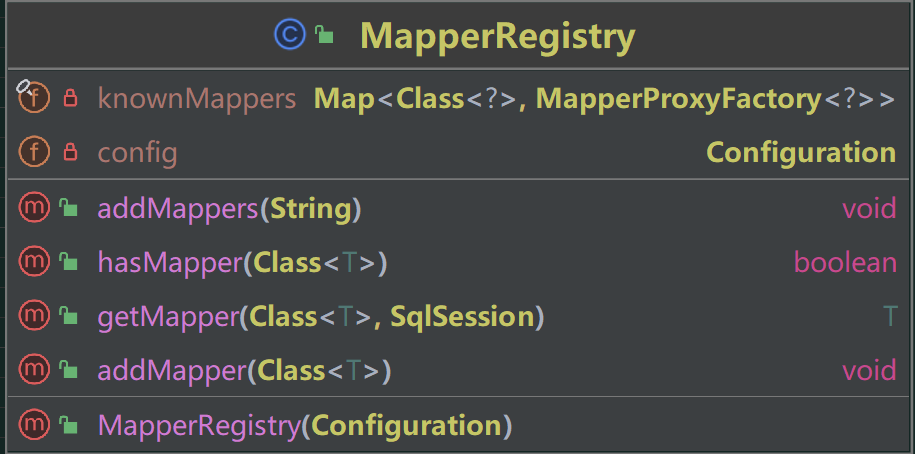
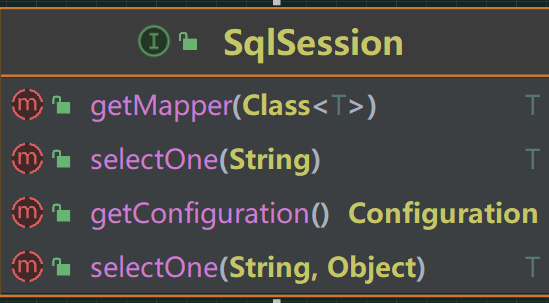
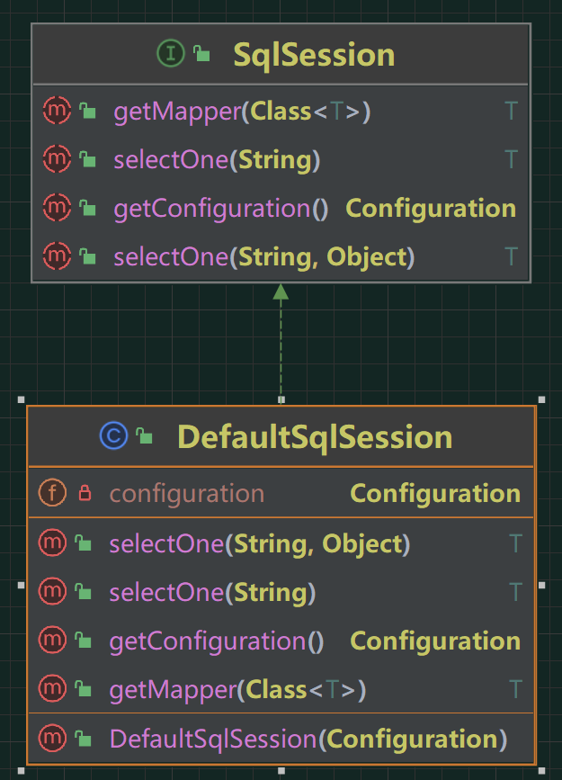
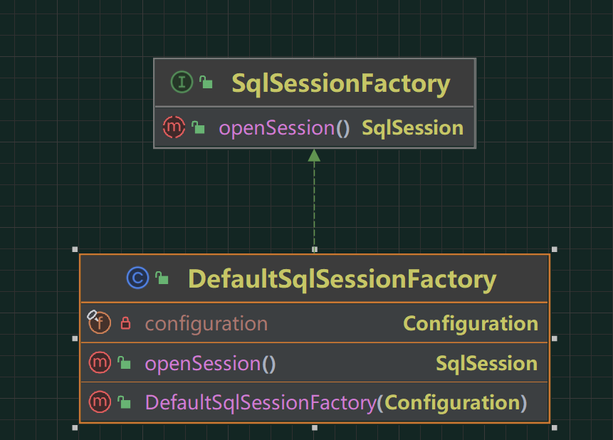

## 引言

在上一篇里我们学会了如何创建一个接口类的代理对象，并且完成对接口方法的调用处理。这个文章我们先来丰富一下我们的SqlSession，同时对映射器的注册提供注册机处理，满足用户可以在使用的时候提供一个包的路径即可完成扫描和注册。

## 开始

在这篇文章中，我要创建一个MapperRegistry扫描指定的包路径，把包路径下符合的接口，通通注册成MapperProxy，通通注册成一个代理类，并且把这些代理类写入到缓存之中，也就是一个map集合存放到MapperRegistry类之中，以后SqlSession去调用的时候，我们就不需要重新扫描了。

### 创建MapperRegistry类

在这里实现我们的添加  获取 Mapper 的方法，添加完成的放到我们本地的mapper之中。

当获取Mapper时，也是优先获取我们本地缓存的map中的MapperProxyFactory。

### SqlSession标准定义和实现

在 SqlSession 中定义用来执行 SQL、获取映射器对象以及后续管理事务操作的标准接口。目前这个接口中对于数据库的操作仅仅只提供了 selectOne，后续还会有相应其他方法的定义。

在DefaultSqlSession中进行实现

### 创建SqlSessionFactory工厂

在工厂里面创建我们的SqlSession。

## 最后

关于对Mybatis源码的学习，参考了https://bugstack.cn/ 这个大佬的文章，我就是在这里学会的，同时这位大佬还分享了很多其他的知识，让我受益匪浅，大家可以点击去学习，十分感谢。