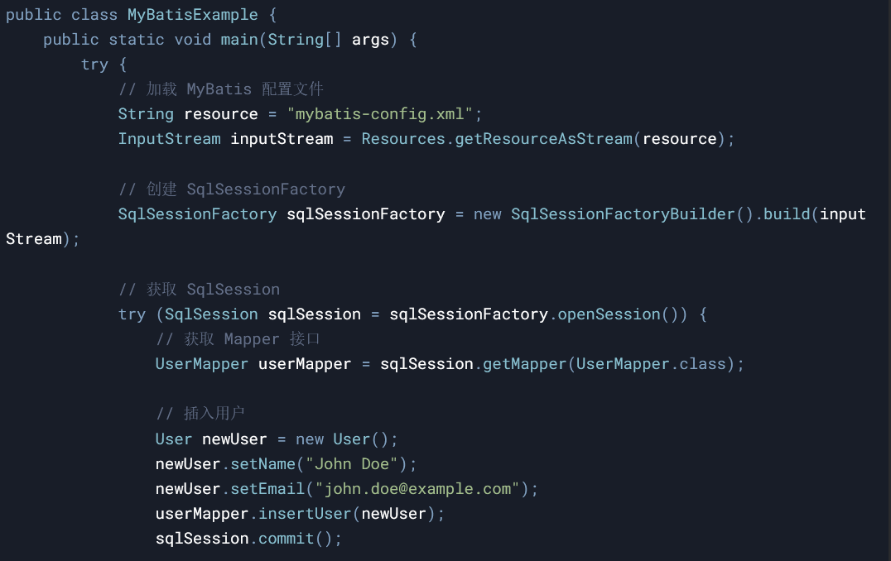
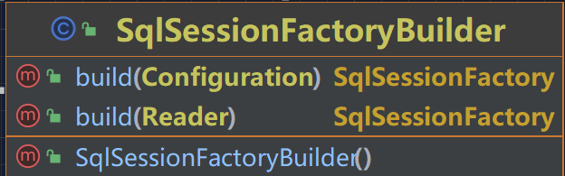
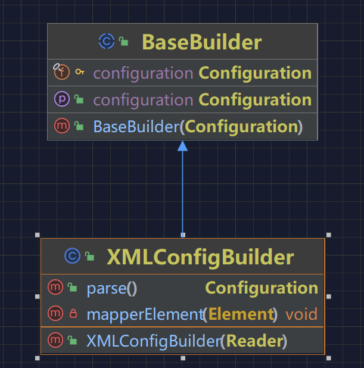
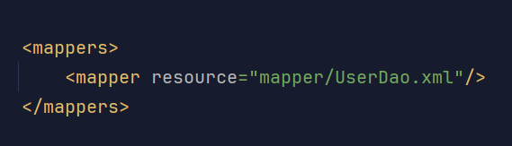

## 引言

本篇文章主要是实现解析Mapper.xml文件中的sql语句，在调用执行DAO方法的时候，输出对应DAO配置到Mapper.xml中的SQL语句信息。

## 实现目标

我们使用了 MapperRegistry 对包路径进行扫描注册映射器，并在 DefaultSqlSession 中进行使用。那么在我们可以把这些命名空间、SQL描述、映射信息统一维护到每一个 DAO 对应的 Mapper XML 的文件以后，其实 XML 就是我们的源头了。通过对 XML 文件的解析和处理就可以完成 Mapper 映射器的注册和 SQL 管理。这样也就更加方便我们操作和使用了。

好比这样的代码，我们要实现 加载MyBatis配置文件 和 创建SqlSessionFactory这两个步骤。

## 详细设计

### 定义 SqlSessionFactoryBuilder 工厂建造者模式类

SqlSessionFactoryBuilder作为整个MyBatis的入口类，通过指定解析XML的IO，引导整个流程的启动。

我们会在其中的build 方法中 通过XMLConfigBuidler 解析我们传入的io流，最后返回一个SqlSessionFactory。

### XML解析处理，创建XMLConfigBuilder 

XMLConfigBuilder 这个类

在这里我们在构造函数中使用dom4j处理我们传入的XML文件，在parse方法里面我们解析我们的映射器，获取mappers标签里面所有的mapper标签，进行解析处理，把解析后的信息，通过Configuration配置类进行存放，包括：添加解析SQL，注册Mapper映射器。

在获取到这个mapper标签之后 ，通过resourse 指定的路径，找到我们定义的xmlyin文件，

通过namespace命名空间可以进行后续的绑定

并且后续的 MappedStatement的 id 是通过 namespace + 我们在xml中写的id 组成的。

parameterType SQL语句的输入参数类型

resultType 期望返回的结果类型

sql 存储实际SQL语句内容（如SELECT * FROM table WHERE id = #{id}）代码中通过正则Pattern.compile("(#\\{(.*?)})")将#{}替换为?

解析配置的整体包括：类型别名，插件，对象工厂，对象包装工厂，设置，环境，类型转换，映射器等等，我们目前还没有完全实现。

## 最后

关于对MyBatis源码的学习，参考了https://bugstack.cn/ 这个大佬的文章，我就是在这里学会的，同时这位大佬还分享了很多其他的知识，让我受益匪浅，大家可以点击去学习，十分感谢。